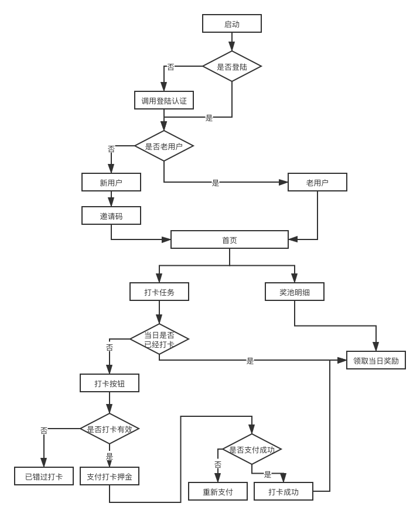

# 早起打卡

## 规则

- 每日支付 n coins(单位待定)参与早起打卡，放入早起打卡奖池。

- 次日早晨5:00-8:00(UTC+8，下文均为此时区)作为早起打卡时间，用户在此期间进行打卡；若成功打卡，可随机分当日奖池内全部鼓励金，奖金设置下限最低0.01 * n，不设上限。

- 用户未在次日早晨5:00-8:00内打卡（例如：已过打卡时间），视为打卡失败，不可参与当日鼓励金的分配。

- 每日瓜分金额于早8点后开始结算，当日9点前到账。

- 如出现用户单笔重复支付，或全部参与用户未打卡情况，该期奖金将原路返回。
  
- 同一id视为同一用户。

- 系统随机奖励，平台不收费用。

## 系统流程

## 存储流程

## RoadMap

- [x] 登陆鉴权 
- [x] 读写gaia数据
- [ ] 待添加

